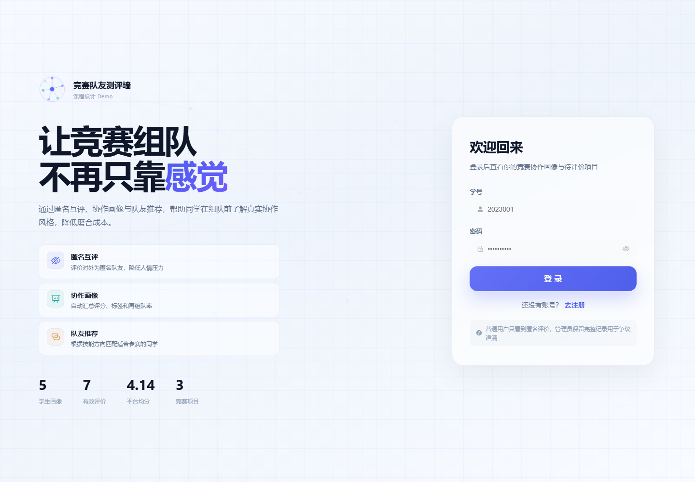
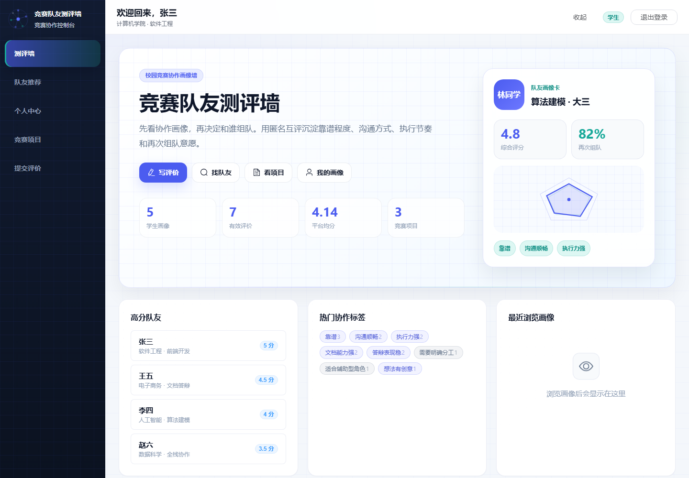
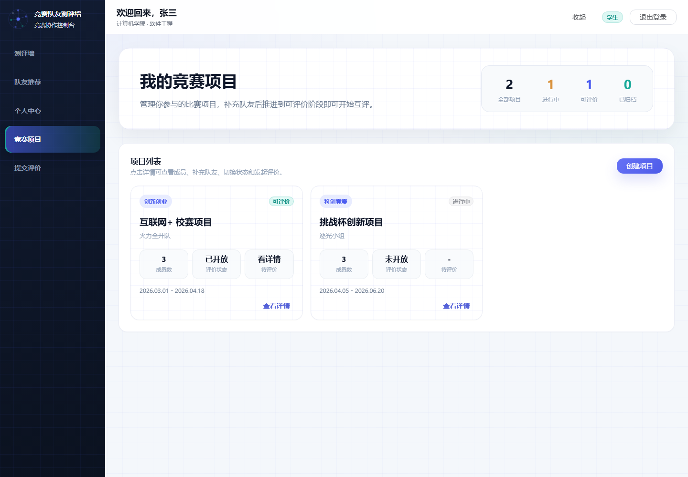
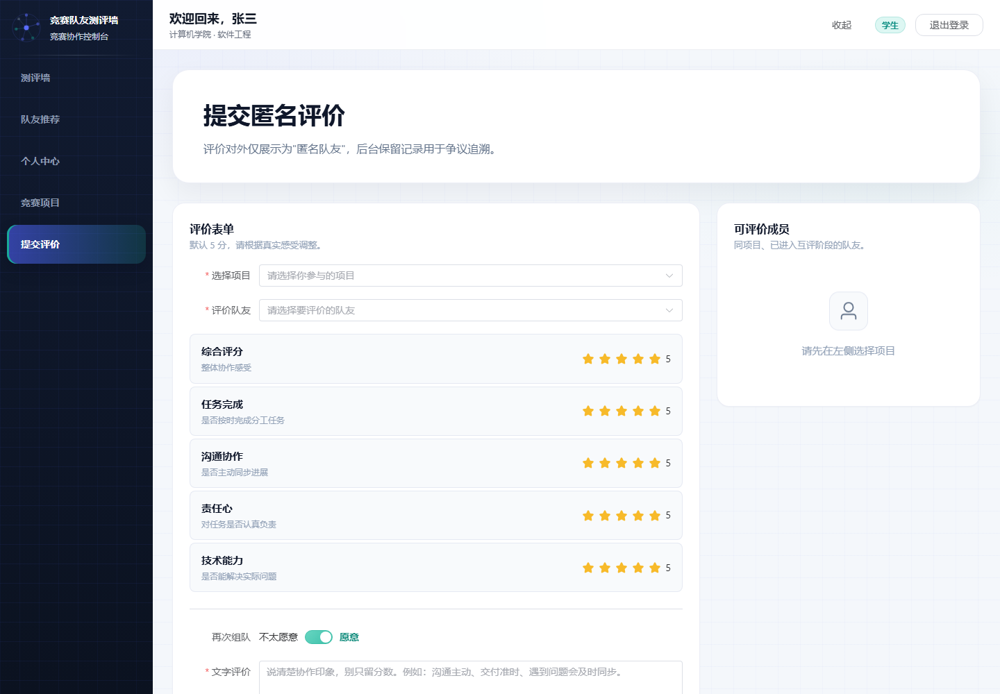
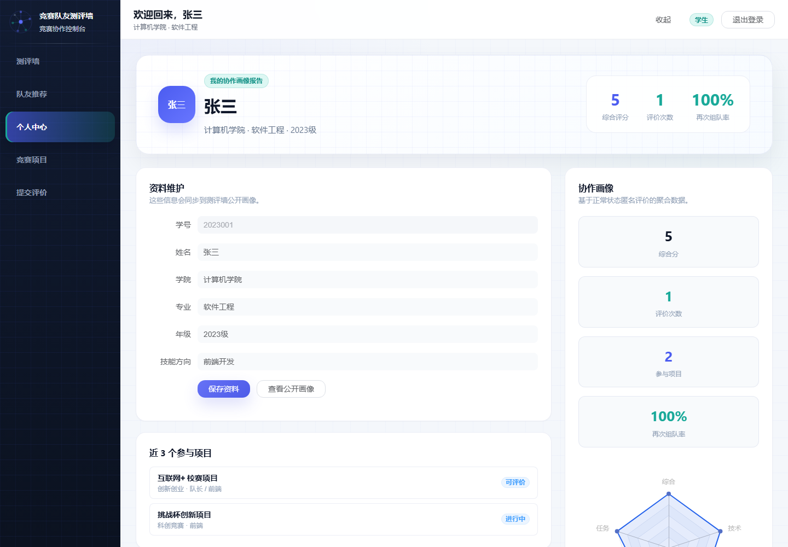
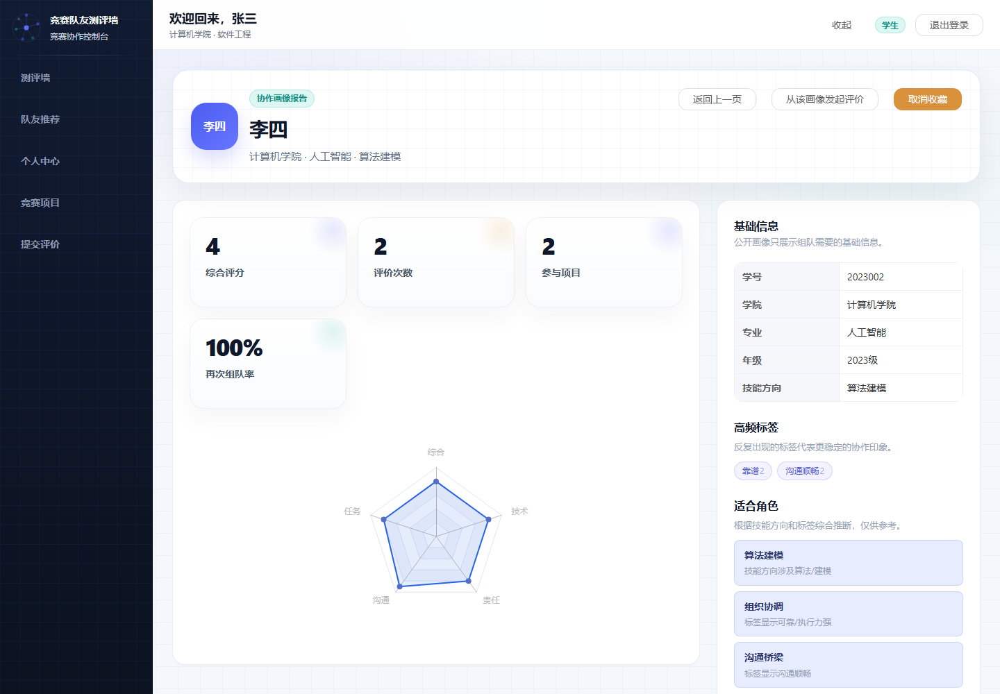
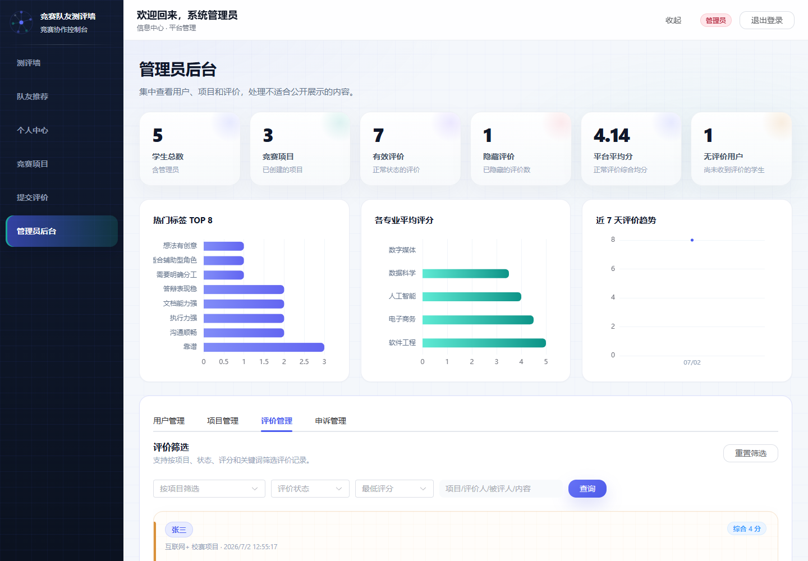

# 竞赛队友测评墙

一个面向课程设计和简历展示的前后端分离 Demo，用于模拟大学竞赛组队后的匿名队友评价、协作画像展示、雷达图可视化和管理员审核闭环。

> 说明：本项目不是正式校园评价系统，不接入学校统一身份认证，也不用于真实学生评价场景。它的重点是展示完整 Web 应用的业务建模、前后端接口联调、JWT 鉴权、MySQL 数据设计和可视化呈现。

## 功能模块

- 用户认证：学生/管理员登录注册，基于 JWT 的接口鉴权。
- 竞赛项目：创建项目、添加队友、切换项目状态、查看评价进度。
- 匿名评价：同一项目成员之间提交匿名评价，包含综合分、分项评分、标签、评论和再次组队意愿。
- 协作画像：聚合评价数据，展示综合评分、标签云、再次组队率、参与项目和匿名评价列表。
- 雷达图可视化：使用 ECharts 展示任务、沟通、责任、技能、综合等维度。
- 测评墙：首页卡片墙展示公开画像，支持筛选、排序、最近浏览和热门标签。
- 申诉与审核：学生可提交申诉，管理员可隐藏不适合公开展示的评价并处理申诉。
- 管理后台：查看用户、项目、评价、申诉和统计数据，形成审核闭环。

## 技术栈

| 层级 | 技术 |
| --- | --- |
| 前端 | Vue 3, Vite, Element Plus, Pinia, Vue Router, Axios, ECharts |
| 后端 | Node.js, Express, mysql2, bcryptjs, jsonwebtoken, cors |
| 数据库 | MySQL |
| 鉴权 | JWT Bearer Token |
| 架构 | 前后端分离，REST API，Vite 代理 `/api` 到后端 |

## 项目结构

```text
competition-review-wall/
├─ backend/                 # Express 后端
│  ├─ src/
│  │  ├─ controllers/       # 控制器层
│  │  ├─ services/          # 业务服务层
│  │  ├─ dao/               # MySQL 数据访问层
│  │  ├─ routes/            # API 路由
│  │  ├─ middleware/        # 鉴权、管理员、错误处理中间件
│  │  ├─ scripts/           # 数据库初始化脚本
│  │  └─ app.js             # Express 应用入口
│  └─ sql/
│     ├─ schema.sql         # 建库建表 SQL
│     └─ seed.sql           # 演示数据 SQL
├─ frontend/                # Vue 3 前端
│  ├─ src/
│  │  ├─ api/               # Axios API 封装
│  │  ├─ components/        # 通用组件
│  │  ├─ layout/            # 应用布局
│  │  ├─ pages/             # 页面
│  │  ├─ router/            # 路由
│  │  ├─ store/             # Pinia 状态
│  │  └─ styles/            # 主题样式
│  └─ vite.config.js
├─ docs/                    # 项目说明文档
├─ screenshots/             # 截图占位说明
└─ README.md
```

## 本地运行

### 1. 准备环境

- Node.js 18+
- MySQL 8.x 推荐
- npm

### 2. 配置后端环境变量

复制后端环境变量示例：

```bash
cp backend/.env.example backend/.env
```

然后根据本地 MySQL 配置修改 `backend/.env`：

```env
PORT=3000
DB_HOST=127.0.0.1
DB_PORT=3306
DB_USER=root
DB_PASSWORD=你的MySQL密码
DB_NAME=competition_review_wall
JWT_SECRET=competition-review-wall-demo-secret
JWT_EXPIRES_IN=7d
FRONTEND_URL=http://localhost:5173
```

### 3. 安装依赖

在项目根目录执行：

```bash
npm run install:all
```

也可以分别安装：

```bash
cd backend
npm install

cd ../frontend
npm install
```

### 4. 初始化数据库

项目已提供 SQL 文件：

- `backend/sql/schema.sql`
- `backend/sql/seed.sql`

推荐方式：

```bash
npm run db:init
```

也可以手动导入：

```bash
mysql -u root -p < backend/sql/schema.sql
mysql -u root -p < backend/sql/seed.sql
```

如果你的 MySQL 用户不是 `root`，请替换为自己的用户名。

### 5. 启动后端

在项目根目录执行：

```bash
npm run dev:backend
```

默认后端地址：

- API: `http://localhost:3000/api`
- 健康检查: `http://localhost:3000/api/health`

### 6. 启动前端

另开一个终端，在项目根目录执行：

```bash
npm run dev:frontend
```

默认前端地址：

- `http://localhost:5173`

### 7. 构建前端

```bash
npm run build
```

## 默认演示账号

管理员：

- 学号：`admin001`
- 密码：`Admin@123456`

学生账号：

| 学号 | 姓名 | 密码 |
| --- | --- | --- |
| `2023001` | 张三 | `Stu@123456` |
| `2023002` | 李四 | `Stu@123456` |
| `2022001` | 王五 | `Stu@123456` |
| `2021008` | 赵六 | `Stu@123456` |
| `2024003` | 陈七 | `Stu@123456` |

## 演示流程

1. 使用学生账号登录，进入首页测评墙，查看公开画像卡片、热门标签和平台概览。
2. 进入“竞赛项目”，查看已有项目或创建一个新项目。
3. 在项目详情中添加队友，并将项目状态切换为“可评价”。
4. 进入“提交评价”，选择项目和队友，填写分项评分、标签、评论和再次组队意愿。
5. 打开用户画像页，查看综合评分、再次组队率、雷达图、标签云和匿名评价便签。
6. 使用管理员账号登录后台，查看评价列表，隐藏不适合公开展示的评价。
7. 使用学生账号发起申诉，再回到管理员后台处理申诉，展示审核闭环。

更详细的演示脚本见 [docs/DEMO_GUIDE.md](docs/DEMO_GUIDE.md)。

## 页面截图

以下截图来自本地运行的 demo 数据：

### 登录页



### 首页 / 测评墙



### 竞赛项目列表



### 提交匿名评价



### 用户画像



### 雷达图画像



### 管理员评价审核



截图说明见 [screenshots/README.md](screenshots/README.md)。

## 核心亮点

- 匿名评价机制：前台统一展示为“匿名队友”，降低人情压力；后台保留真实关联用于审核追溯。
- 协作画像：将评分、标签、再次组队率、项目经历聚合成可浏览的队友画像。
- 雷达图可视化：将多维评分转换为直观图表，便于快速判断协作风格。
- 管理员审核闭环：支持隐藏评价、处理申诉、查看后台数据，体现内容治理思路。
- JWT 登录鉴权：前端保存 token，后端通过中间件保护用户接口和管理员接口。
- 前后端分离：Vue 前端通过 Axios 调用 Express REST API，开发环境通过 Vite 代理联调。
- 简历展示友好：包含演示数据、默认账号、接口说明、数据库设计和演示流程文档。

## 课程设计说明

本项目适合作为课程设计或简历项目展示，重点体现：

- 从业务场景抽象数据模型：用户、项目、成员、评价、标签、申诉、操作日志。
- 使用分层后端结构组织代码：routes、controllers、services、dao、middleware。
- 使用前端组件化组织复杂页面：画像卡、评价列表、雷达图、评分卡、项目表单。
- 完成从登录、业务操作、数据聚合到后台审核的完整流程。

## 风险与边界说明

- 不是正式校园系统：未接入统一身份认证、实名审核、学校组织架构或合规流程。
- 不适合真实公开评价：真实场景需要更严格的隐私保护、内容审核、申诉仲裁和数据权限。
- 推荐能力是 Demo 级：当前以筛选、标签、画像展示为主，不包含复杂推荐算法。
- 风控能力有限：未实现自动敏感词识别、反刷评价、异常评分检测等生产级能力。
- 数据库为演示数据：`seed.sql` 会重置并写入示例数据，请勿在生产数据上直接执行。

## 更多文档

- [接口说明](docs/API.md)
- [数据库设计说明](docs/DATABASE.md)
- [演示流程](docs/DEMO_GUIDE.md)
- [贡献说明](CONTRIBUTING.md)

## License

MIT License. See [LICENSE](LICENSE).

## 推荐 GitHub About

Description:

```text
Vue 3 + Express + MySQL 的竞赛队友匿名评价与协作画像墙课程设计 Demo
```

Topics:

```text
vue3, vite, element-plus, pinia, express, mysql, jwt, echarts, course-design, full-stack, anonymous-review, student-project
```
